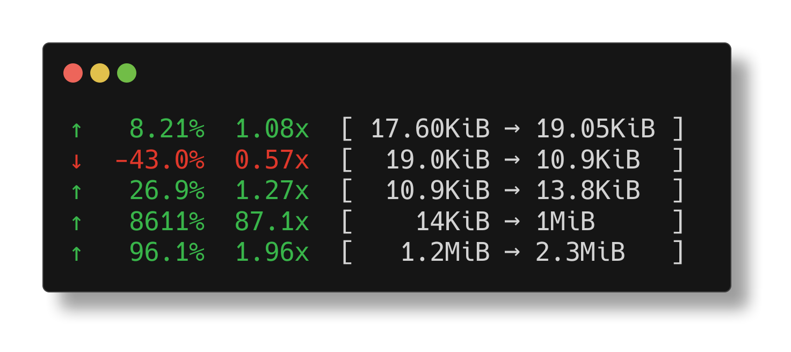

<p align="center">
  
</p>

# `pc` - Change Calculator for the Terminal

`pc` is a lightweight, blazing-fast tool that simplifies both the calculation
and the understanding of differences between numbers. It allows you to quickly
evaluate performance changes and offers meaningful human-formatted output, all
within the convenience of your terminal.

## ✨ Features

- 🔥 **Fashionable Output:** Human readable, colorful, and easy to understand
- 🎯 **Always Accurate:** Calculates percent change correctly every time
- 🚀 **Blazing Fast:** Don't wait, get your results instantly
- ❤️ **Zig-Powered:** Crafted with love using Zig

## 🛠️ Usage

### 💻 Basic Calculation

Compute percentage changes and differences effortlessly:

```sh
❯ pc 18024 19503 11124 12321 340200 424212 1000000000
↑    8.21%  1.08x  [ 17.60KiB → 19.05KiB ]
↓   -43.0%  0.57x  [  19.0KiB → 10.9KiB  ]
↑    10.8%  1.11x  [  10.9KiB → 12.0KiB  ]
↑    2661%  27.6x  [    12KiB → 332KiB   ]
↑    24.7%  1.25x  [ 332.2KiB → 414.3KiB ]
↑  235631%  2357x  [   414KiB → 954MiB   ]
```

### 🎓 Friendly Sizes by Default

Large numbers are automatically translated into familiar sizes like GiB, MiB, KiB:

```sh
❯ echo "1124122523 2421252122" | pc
↑  115.39%  2.15x  [ 1.0GiB → 2.3GiB ]
```

Need raw numbers? Use the `-r` option:

```sh
❯ echo "1124122523 2421252122" | pc -r
...
```

### 🔀 Flexibility with Delimiters

Customize input with different delimiters or use the default ones (` \n\t\r,;:|`):

```sh
❯ echo "15@20@3 6" | pc -d "@"
...
```

### 📐 Fixed Calculation

Evaluate changes relative to the first number:

```sh
❯ echo "128 221 150" | pc -f
...
```

For the full command list, simply run:

```sh
pc --help
```

### 📄 Output Formats

Specify the output format with the `--format` option. Currently, `pc` supports
the following formats:

- Human-readable (default)
- JSON
- CSV

#### JSON Output

```sh
❯ pc 18024 19503 11124 --format json
[{"percent":8.20572566986084e+00, ... }, ...]
```

#### CSV Output

```sh
❯ pc 18024 19503 11124 --format csv
percent,times,prev,cur
8.20572566986084,1.082057237625122,18024,19503, ...
```

## 📥 Installation

### Prebuilt Binaries Available

Find them on the [releases](https://github.com/cgbur/pc/releases) page.

### Build from Source

To build from source, you'll need [Zig](https://ziglang.org):

```sh
git clone https://github.com/cgbur/pc.git
cd pc
zig build -Doptimize=ReleaseSafe
cp zig-out/bin/pc ~/.local/bin/pc
```

## 📝 Future Plans

- \[ \] Think of more features to add
